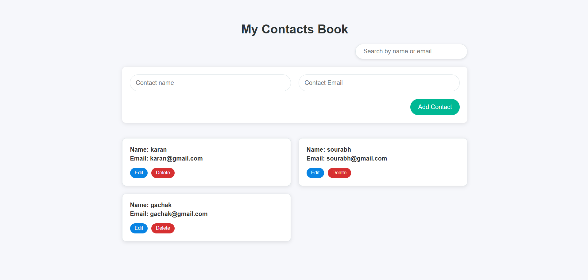

# 📖 My Contacts Book

A simple and stylish web app to **manage your personal contacts** — built using **HTML, CSS, and JavaScript**.



---

## ✨ Features

- ✅ Add new contacts (name + email)
- ✅ Edit existing contacts
- ✅ Delete contacts with confirmation
- ✅ Live search by name or email
- ✅ Modern, responsive UI
- ✅ Data stored in **LocalStorage** (persistent even after refresh)
- ✅ Visual feedback when contact is updated

---

## 📁 Folder Structure

```
my-contacts-book/
│
├── index.html        # Main HTML file
├── style.css         # Styles for layout and UI
├── script.js         # All JavaScript logic
├── README.md         # This file
└── screenshot.png    # Optional preview image
```

---

## 🚀 Getting Started

### 📌 Prerequisites
- Any modern browser (Chrome, Firefox, Edge, etc.)

### 📦 Setup Instructions
1. **Download or Clone** this repository:
   ```bash
   git clone https://github.com/yourusername/my-contacts-book.git
   cd my-contacts-book
   ```

2. **Open `index.html`** in your browser:
   - You can double-click it, or
   - Use VSCode with the Live Server extension for auto-reloading.

---

## 🛠️ Technologies Used

- **HTML5**
- **CSS3**
- **Vanilla JavaScript (ES6+)**
- **LocalStorage API**

